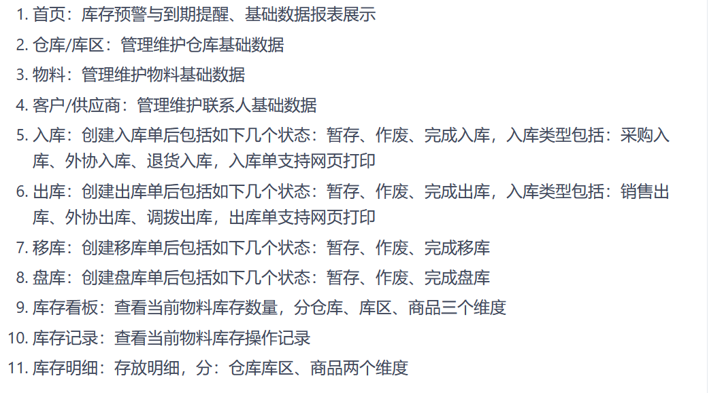

# WMS Auto-Report Setup Instructions

## Mini WMS Information

```bash
  As leading logistics company, we will build auto-report using python for WMS visibility

  In our min-postgresql Database, you can query data from below tables:
```

### Database Tables
| Table Name       | Description                                            | 
|-------------------|-------------------------------------------------------|
| `RECEIPT`         | Inbound Header Table                                  |
| `RECEIPTDETAIL`   | Inbound Detail Table, foreigh key is receiptkey       | 
| `ORDERS`          | Outbound Header Table                                 | 
| `ORDERDETAIL`     | Outbound Detail Table, foreight key is orderkey       | 
| `ITRN`            | Activity Details                                      | 
| `LOTXLOCXID`      | Inventory detail                                      | 
| `LOTATTRIBUTE`    | Inventory detail for LOT attribute                    | 

## Task Details
```bash
  We will build one comsolidation reports with 5 sheets:

  Sheet name: "Inbound"
```